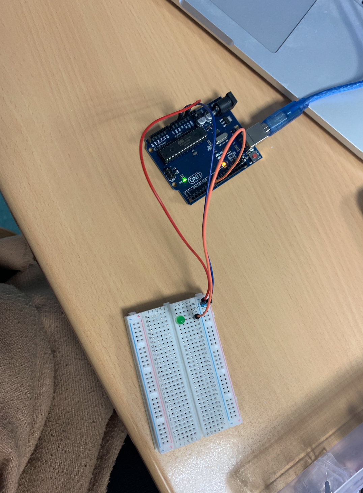

# Exercise 1 

In this exercise, we need to test your LED by connecting the orange wire to the red bus (VCC).
You can see our circuit in this photo.

## Schematic 


## Code
 ```Arduino
void setup(){
  ....
}

void loop(){
  ....
}
```
  
## Board Image


To make a gif you can use [ezgif](https://ezgif.com/maker).
## Issues
- bla bla
- bla bla
- bla bla
